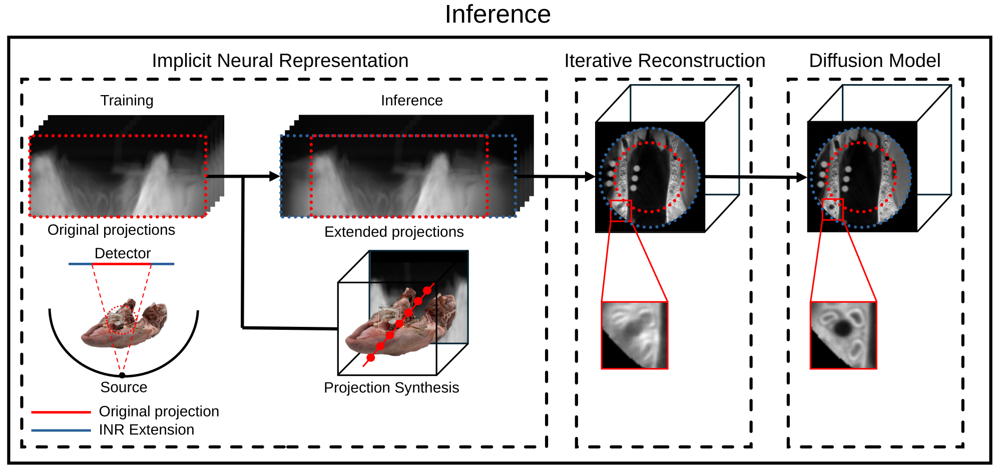

# CBCT Field-of-View Extension 

This is the official repository for the Paper "Field-of-View Extension in Dental Cone-Beam CT via Implicit Neural Representations and Diffusion Model-Based Refinement".

We use a three-stage framework that consists of (1) an implicit neural representation (INR) for estimating missing portions of the cropped projection data, (2) an iterative reconstruction for generating a secondary volumetric image with improved anatomical consistency and (3) a fast diffusion model for image enhancement.

The INR model builds on the work of Zha, R., et al. [1] ([NAF](https://github.com/Ruyi-Zha)) with modifications described in our paper. The fast diffusion model builds on the work of et al. [2]([DDPM](https://github.com/openai/improved-diffusion)) 



# How to Run This Repository

Follow the steps below to set up and run this repository.

## Step 1: Set Up the Environments
For data generation and image reconstruction, first install [TIGRE toolbox](https://github.com/CERN/TIGRE). To run the INR model, install the dependencies listed in [`requirements.txt`](naf/requirements.txt). To run the diffusion model, install the dependencies listed in [`requirements.txt`](inr-diffusion/requirements.txt).

## Step 2: Get the Data
We used the publicly available MMDental dataset that can be downloaded [here](https://springernature.figshare.com/articles/dataset/MMDental_-_A_multimodal_dataset_of_tooth_CBCT_images_with_expert_medical_records/28505276?file=53187695).


## Step 3: Training of the INR

1. Run the INR training in the naf directory with:

   ```bash
   python train_adapt.py
   ```

## Step 4: Training of the fast DDPM

1. Adapt the `run.sh` script:
   - Set the GPU to use on the second line (`SAMPLE="..."`)
   - Change the `--data_dir`, `--model_path`, and `--output_dir` options to reflect the correct paths for your setup

2. Run the sampling process:

   ```bash
   bash run.sh
   ```

## Acknowledgements
We thank the authors of the publicly available [TIGRE toolbox](https://github.com/CERN/TIGRE). 

## References
Zha, R., et al.: "NAF: Neural Attenuation Fields for Sparse-View CBCT Reconstruction" arXiv preprint arXiv:2209.14540 (2022).

Durrer, A., et al.: "Denoising Diffusion Models for Inpainting of Healthy Brain Tissue." arXiv preprint arXiv:2402.17307 (2024).


